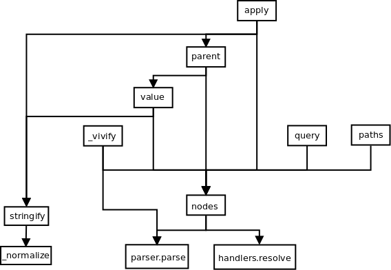

# Intro
This document is an audit of the https://github.com/dchester/jsonpath library

dchester/jsonpath is a javascript implementation of the JSONPath protocol. JSONPath is used to query and JSON documents using targeted expression to match one or more elements. This analysis details functionaliy of the dchester/jsonpath library from the top level down.

# Prerequisites

The user installs dchester/jsonpath from the npm library using one of the many tools to download node dependencies and imports it into their application like so:

```
var jp = require('jsonpath');
var names = jp.query(object, expression);
```

Object is a Javascript object representative of the JSON to query and expression is a JSONPath expression in string format. We will not go into the JSONPath specification in detail here, see many resources online on the subject to go into those details.

The npm module ships with the **jsonpath.js** library as one module in the top level directory. This module contains all dependencies builtin. It is compiled from the seperate modules that consititute the project through invocation of the *grunt* utility. *grunt* is a javascript task runner that reads tasks defined in the *Gruntfile* file to be executed. In the case of the dchester/jsonpath project, the Gruntfile defines two tasks, both of which are run as the default tasks when the 'grunt' command is executed:

- browserify - combines javascript sources starting from **lib/index.js** along with all dependencies to produce **jsonpath.js**
- uglify - produces a minified / obfuscated **jsonpath.min.js** from jsonpath.js

From this point on we will be exploring the source code defined in the **lib** directory of the project which contains the primary implementation of the library. Modules from the **include** and **generated** directories are also pulled into these modules and functionality is tested via the unit tests in **tests**

# Library implementation

## index.js initialization
This module defines the top level definition of the **JSONPath** class which is instantiated and exported for use in client applications. JSONPath itself is set as a self-named attribute on the instance. The **Handlers** and **Parser** classes (more on these below) are set as self-named attributes on JSONPath.

The **JSONPath** construction invokes the **initialize** method on *this*.

*initialize* instantitates the **parser** and **handler** members to new instances of the Handlers and Parser classes respectively

## Top level methods

The JSONPath class defines the following methods on its prototype, available for use by invoking the exported instance pulled in by the require.

It needs to be noted that in all functional defintions, arguments are as follows

- obj - the Javascript object representative of the JSON being evaluated
- path / string - the JSONPath expression being evaluated

### parse(string)

Parses the provided expression into path components

- dispatches to **parser.parse** && returns

### parent(obj, string)

Returns the parent of the 1st matching element

- Calls **nodes(obj, string)** and stores the first node
- Removes the first path elelemnt
- Calls **value** with object and node path

### apply(obj, string, fn)

Runs function of each matching element, replacing the element wit hthe return value of the function

- Calls **nodes(obj, string)** and sorts according to path length
- forEach node
  - Pops the the last path component, stores as key
  - Calls **value(obj, stringify(node.path))** to retrieve parent value
  - Calls specified function and stores result as node value
  - Sets parent[key] to result
  - Returns nodes

### value(obj, path, value)

Returns value of first element matching expression. If a new value is provided, replaces the matching element value with that and returns.

- If new value is provided
  - Calls **nodes(obj, path)**, stores first
  - If no node exists, calls **_vivify(obj, path, value)** are returns result
  - Slides of last element of node path, stores as key
  - Calls **parent(obj, stringify(path))** and stores as parent
  - Sets parent[key] to value
- Calls **query(obj, stringify(path), 1)** returns first element

### vivify(obj, string, value) - internal function

Creates new node at given path in object and sets value on it

- Invokes **parser.parse(string)** and iterates over result, storing path values
- Recursively traverses object to path, creating new elements as needed (of type object or array). Finally sets value at terminus
- Calls **query(obj, string)** and returns first element

### query(obj, string, count)

Returns values in obj matching expression, up to *count* if specified

- Calls **nodes(obj, string, count)** mapping the returned value to node values and returns

### paths(obj, string, count)

Returns paths in obj matching expression, up to *count* if specified

- Calls **nodes(obj, string, count)** mapping the returned value to node paths and returns

### nodes(obj, string, count)

Returns nodes (object containing path and value) matching expression, up to *count* if specified

- Invokes **parser.parse(string)** stores as path
- Initializes *partials* to **[ { path: ['$'], value: obj }**
- Initializes *matches* to empty array
- Iterates over path components
  - Calls **handlers.resolve(component)**, stores as handler
  - Iterates over existing partials (iteration variable: *p*) 
    - Calls **handler(component, p, count)**
    - If last path component, appends handler result to matches
    - Else appends result to partials
- Returns matches splices to count

### stringify(path)

Converts path to expression

- Calls **_normalize(path)**
- Initialies *string* with "$"
- Iterates over each path component
  - If component type is literal, sets component value to JSON.stringify(value)
  - Applies value to template determed by component **scope**-**operation** and appends result to *string*
- Returns *string*

### _normalize(path) - internal function

Converts string path components to path expressions

- Iterates over each path component
  - Infers if literal member or array/object subscript, appends appropriate expression component

### Function flow

See the following diagram for overall flow



## Parser

The JSONPath syntax parser is autogenerated using the **JISON** parser generator (available via npm)

JSON takes a BNF grammer and generates logic to parser strings and executes logic

**package.json** (read by nodejs utilities such as npm and yarn) defines the **generate** task which launches bin/generate_parser and redirects the output to **generated/parser**.

- generate_parser imports JISON and the grammer from lib/grammer.js and outputs the results
- generated/parser is imported into and exported from **lib/parser** for use in index.js as described above
- lib/grammer pulls in *module* and *action* logic from the **include** directory which defines top level *Abstract Syntax Tree* (**AST**) management logic (constructing the AST as BNF rules are applied)
- lib/grammer also pulls in lib/dict into the grammer definition

## Handlers

Finally lib/handlers defines the Handlers class which is used in index.js to traverse the JSON object in accordance with the JSONPath expression represented in an AST as parsed by the parser.

It should be noted that Handlers uses static-eval to evaluate expressions in JSONPath, while the library readme states that it is safe, static-eval documentation states that it should **not** be used to execute arbitrary user input.

